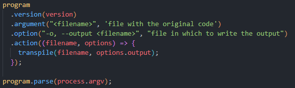
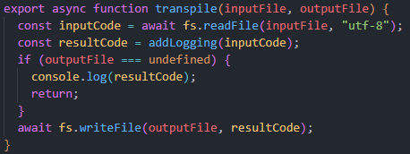
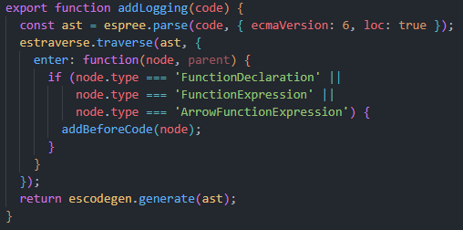
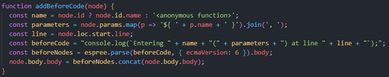
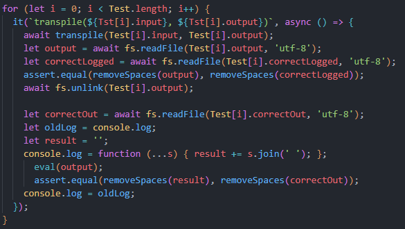
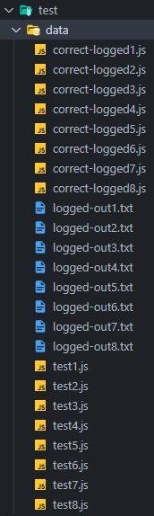

[](https://classroom.github.com/open-in-codespaces?assignment_repo_id=10282909)
# Práctica Espree logging

## Indicar los valores de los argumentos

Se ha modificado el código de `logging-espree.js` para que el log también indique los valores de los argumentos que se pasaron a la función. 
Ejemplo:

```javascript
function foo(a, b) {
  var x = 'blah';
  var y = (function (z) {
    return z+3;
  })(2);
}
foo(1, 'wut', 3);
```

```javascript
function foo(a, b) {
    console.log(`Entering foo(${ a }, ${ b })`);
    var x = 'blah';
    var y = function (z) {
        console.log(`Entering <anonymous function>(${ z })`);
        return z + 3;
    }(2);
}
foo(1, 'wut', 3);
```

## CLI con [Commander.js](https://www.npmjs.com/package/commander)

La CLI con commander se ha realizado como en los anteriores laboratorios. En el fichero ejecutable se definen las distintas opciones así como los argumentos que hay que pasarle al programa y luego se llama a la función `transpile` para procesar la entrada y realizar las funciones programadas, en este caso, añadir logs en las entradas de cada función indicando el nombre, a no ser que sea de tipo expresión o función flecha, los argumentos y la línea del fichero original donde se encuentre.



Al ejecutable se le deberá pasar un fichero de código fuente en JavaScript, que se le pasará al transpilador. Además, especificando la opción `-o <fichero_salida>` se podrá redirigir el código con los logs al fichero pasado como argumento.

También se encuentran disponibles las opciones para la ayuda y para la versión, `-h | --help` y `-V | --version` respectivamente.

Por otra parte, la función `transpile` recibe como argumentos el fichero de entrada y el de salida. Primero se lee y almacena el código de entrada, para luego pasárselo a la función `addLogging`, encargada de añadir los logs en las entradas a las funciones. Tras recibir el código final, se comprueba si se ha pasado un fichero con la opción `-o` volcando el código salida en él, en caso contrario se muestra por pantalla.



## Adición de logs

Como se mencionó antes, los logs se añaden a las entradas a las funciones en `addLogging`. Esta función recibe como parámetros el código de entrada y devuelve el código con los logs añadidos. Dentro se genera el AST que representa el código de entrada y se recorre, haciendo uso de la herramienta `traverse` de [estraverse](https://github.com/estools/estraverse). Al entrar en cada nodo del árbol se ejecuta la función definida en la propiedad `enter`, que comprueba si el nodo actual es alguno de los tipos de función que buscamos, llamando a la función `addBeforeCode` en caso afirmativo. La función finaliza regenerando el código con el AST modificado y retornándolo.



En cuanto a la función `addBeforeCode`, se encarga de modificar el nodo del AST que nos interesa para inyectar el log en el body de la función. Recibe como parámetro el nodo en cuestión y almacena en variables el nombre de la función, a no ser que sea una función expresión o función flecha en cuyo caso almacena la cadena *anonymous function*; los parámetros de la misma en una cadena con las variables interpoladas, si no tiene almacenará una cadena vacía; y el número de la línea en la que se encuentra la entrada a la función.
Tras esto, crea la cadena con el log y genera un nodo con las siguientes líneas:
```javascript
const  beforeCode  =  "console.log(`Entering "  +  name  +  "("  +  parameters  +  ") at line "  +  line  +  "`);";
const  beforeNodes  =  espree.parse(beforeCode, { ecmaVersion: 6 }).body;
```
Y finaliza concatenando este nodo al body del nodo de la función:
```javascript
node.body.body  =  beforeNodes.concat(node.body.body);
```



## Reto 1: Soportar funciones flecha

El reto de soportar las funciones flecha se ha resuelto viendo como se llama el nodo de una de estas funciones haciendo uso de [AST explorer](https://astexplorer.net/) y añadiéndolo a la condición que permite llamar a la función `addBeforeCode` en `addLogging`.
```javascript
if (node.type  ===  'FunctionDeclaration'  ||
	node.type  ===  'FunctionExpression'  ||
	node.type  ===  'ArrowFunctionExpression') {
addBeforeCode(node);
}
```

## Reto 2: Añadir el número de línea

Para añadir el número de línea se ha habilitado la propiedad *loc* en el árbol espree, especificándolo en el parser que genera el AST del código de entrada en la función `addLogging`. Luego solo queda almacenar el valor de la propiedad *line* dentro de *start* dentro de *loc*.
```javascript
const  ast  =  espree.parse(code, { ecmaVersion: 6, loc: true });
const  line  =  node.loc.start.line;
```

## Tests and Covering

Por último, el testing se ha realizado como en anteriores laboratorios también, así como el estudio de cubrimiento. En cada test se transpila la entrada a un código intermedio y se compara con un fichero que contiene el código que debería generar. Tras esto se ejecuta con `node` y la salida se compara con un fichero que contiene la salida esperada. Esto se repite con cada uno de lo 8 tests existentes.





El covering se ha realizado con el comando
```bash
nyc npm run test
```

## Publicación del módulo

El módulo fue publicado en npm en el ámbito @alu0101391793. Puede ser instalado como dependencia con el comando
```bash
npm install @alu0101391793/espree-logging
```
y usar sus funcionalidades con el ejecutable `funlog`.
Además, en GitHub pages se encuentra la documentación generada con JSDoc del módulo, así como en la [página del módulo](https://www.npmjs.com/package/@alu0101391793/espree-logging).